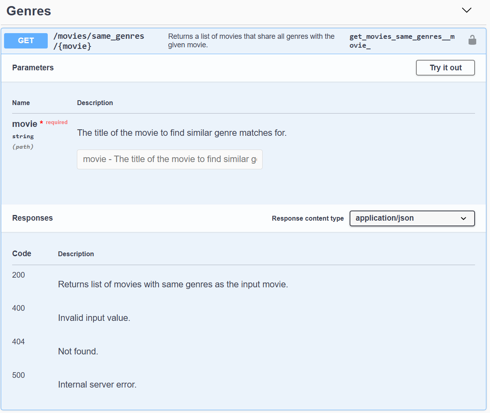
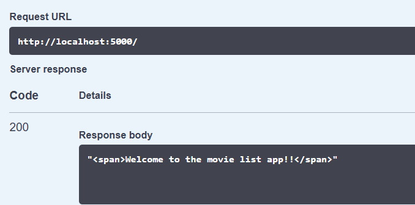
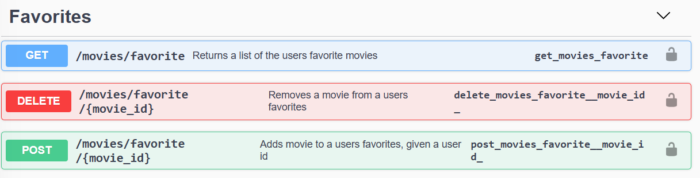
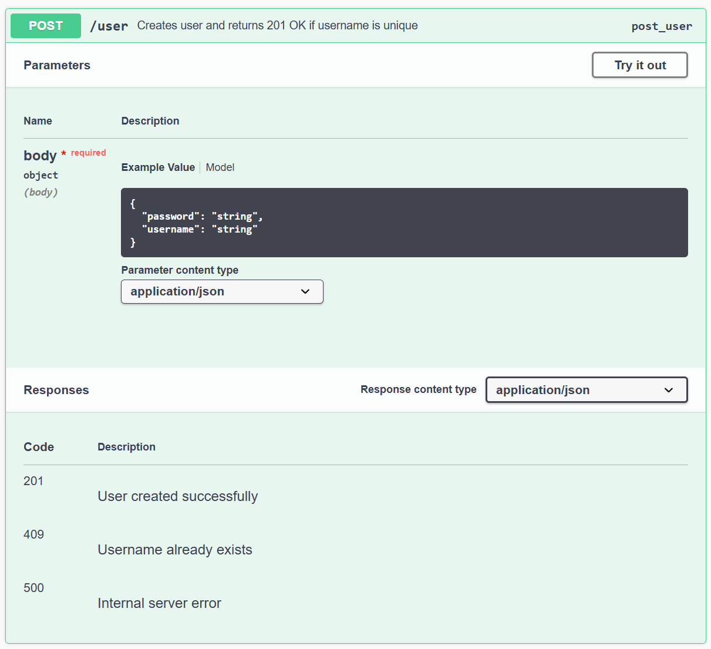
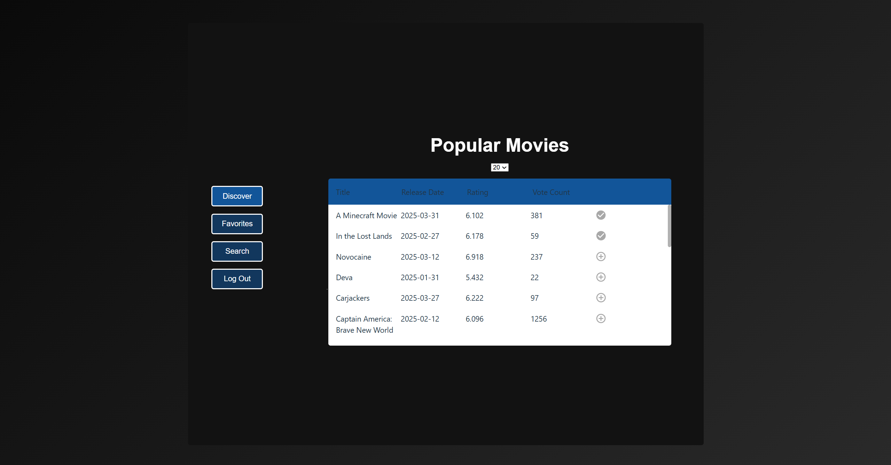
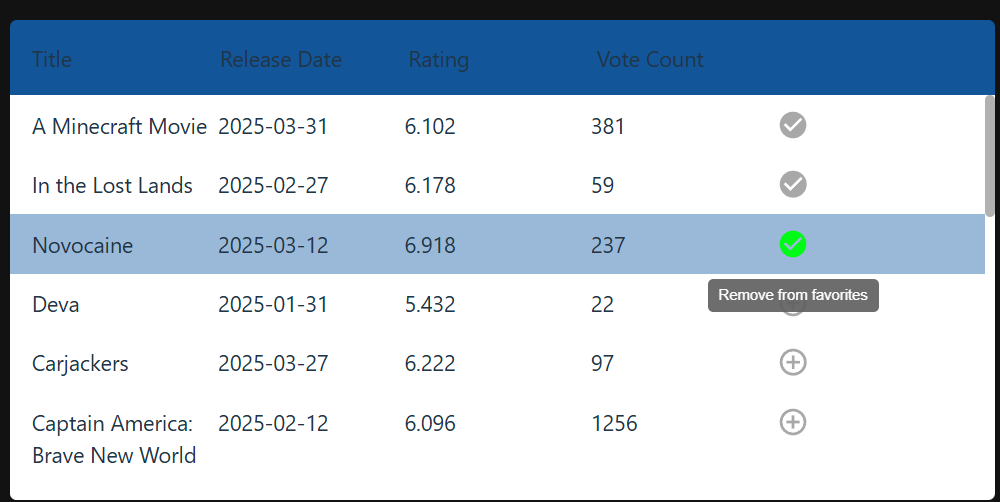
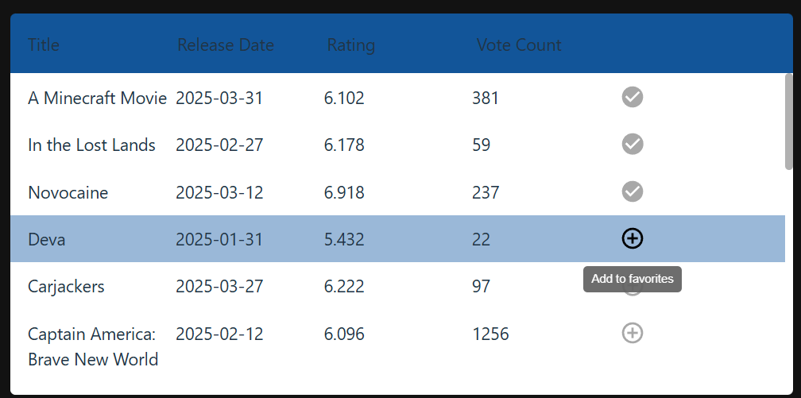
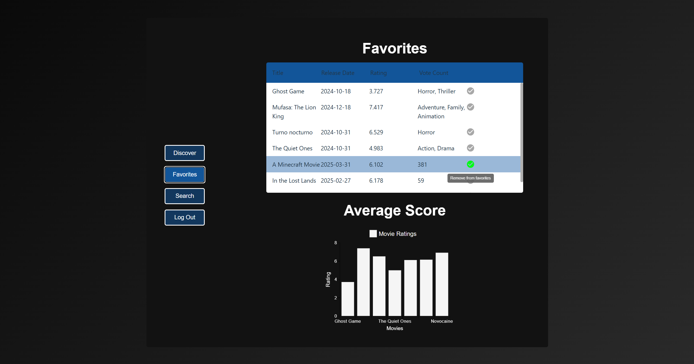
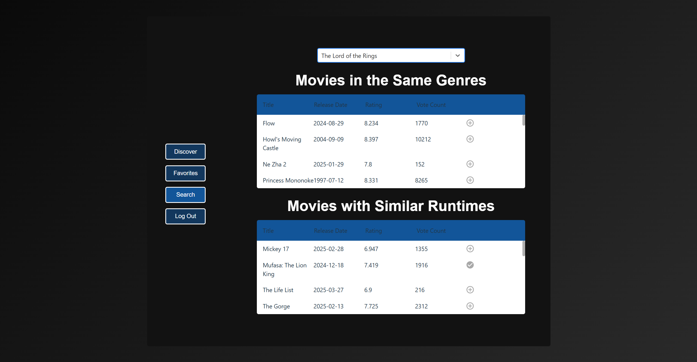

**First name:** Dio

**Last name:** Ngei Okparaji

**Obligatory files:**
- [run_api.sh](./run_api.sh)
- [run_script](./run_script.sh)
- [app.py](./ds_webapp/ds_webapp/app.py)
- [consume_api.py](./ds_webapp/ds_webapp/tests/test_consume_api.py)
- [manual.pdf](./manual.pdf)

**Explain how your API follows the RESTful principles.**

**Principle 1: Client-Server Architecture**
- The backend of the application handles all data management and accompanying logic: fetching data from the external Movie Database API, and managing users and favorites in the app’s database.
- The client (= frontend) is not dependent on the server (= backend) and can be maintained and scaled separately. In practice, these would also be split into separate repositories.

**Principle 2: Stateless**
- No session state is maintained between requests. A user logs in using JWT authentication. The backend checks token validity on requests where JWT tokens are required. Every request thus contains all necessary info to fulfill it. An example is getting movies of the same genre:  

- Only the movie title and the user's bearer token are required, and the request can be fulfilled.

**Principle 3: Uniform Interface**
- Consider again the endpoint used to get movies of similar genres. A standard HTTP format is used to process the request.  
- Standard HTTP codes are used in responses (e.g. 200 OK, 404 Not Found, ...).

**Principle 4: Cacheability**
- All responses contain a `Cache-Control` header. For responses that are not cacheable, this is set to `"no-store"`. For cacheable responses, it is set to the appropriate duration in seconds.  
- For example, the JWT token created/fetched in the backend is valid for 3 hours, so the `Cache-Control` is set to 10,800 in this response.

**Principle 5: Layered System**
- The system consists of different layers: a backend in Python, a database in PostgreSQL, a frontend in TypeScript, and a connection to The Movie Database API.
- This makes it possible, for example, to spin up multiple instances of the backend and introduce load balancing if necessary.

**Principle 6: Code on Demand**
- The setup is compatible with returning code on demand. For example, the welcome message returned when calling `'/'` is a message wrapped in a `<span/>`:  



**URL choices**
This is best explained by looking at an example. Below is an image of the endpoints used for a user to manage their favorite movies:  
&nbsp;&nbsp;&nbsp;


The URL is designed to be short and intuitive. A user can probably guess the URL they need to call to retrieve their favorite movies. Adhering to REST URI design principles, the path contains only nouns. All parameters (query/path) are included in the path for readability, except for credentials, which are passed in the body for security.

---

**[Optional] Motivate your design decisions. Are there any designs you considered but decided not to implement? Why?**

I chose a three-layered architecture because it's a widely used and effective pattern for building modern web applications. It clearly separates concerns between the frontend, backend, and database layers, allowing each to be developed, maintained, and deployed independently. This modular approach improves scalability, simplifies debugging, and supports cleaner code organization.

My goal was to build a production-grade, deployable full-stack application as a personal challenge, so I opted for a realistic setup with PostgreSQL as the database. However, considering the small scale of the application, a lighter-weight solution like SQLite could have been a more pragmatic choice. SQLite requires no separate service or setup, making it ideal for development or lightweight apps.

---

**Discuss efficiency. How would you improve the performance optimization of your API?**

- Load balancing and auto-scaling could be introduced to the API using a tool like Kubernetes. Since the application is already containerized, this would be relatively simple to implement.

---

**Fault tolerance: Can your API handle faulty requests? If so, what kind of errors does it address, and how are they handled?**

Every endpoint has a specific set of error codes to cover different failure modes.  
For example, the endpoint for creating a user account looks as follows:  
&nbsp;&nbsp;&nbsp;

Examining the backend code shows how different failure modes are handled and appropriate HTTP status codes are returned:
```python
        async def create_user_async():
            return await user_table.add_user(username=username, password=password)

        try:
            result = async_request(create_user_async)

            if result:
                # case: creating the user was successful
                response = jsonify({"message": f"User {username} created successfully"})
                response.headers["Cache-Control"] = "no-store"
                response.status_code = 201
                return response

            # case: unknown failure
            response = jsonify({"message": "Internal server error"})
            response.headers["Cache-Control"] = "no-store"
            response.status_code = 500
            return response

        except asyncpg.UniqueViolationError:
            # case: username already exists
            response = jsonify({"error": "Username already exists"})
            response.headers["Cache-Control"] = "no-store"
            response.status_code = 409
            return response

        except Exception:
            # case: unknown exception
            response = jsonify({"message": "Internal server error"})
            response.headers["Cache-Control"] = "no-store"
            response.status_code = 500
            return response
```

---

**[Extension] Carefully discuss your extensions. Describe what you have added and why. If you implemented additional technologies or algorithms, explain what they do, and how they function.  
Note: Your extensions will be primarily evaluated based on the report, so ensure that each extension is documented with sufficient depth.**

**Frontend in TypeScript with React**  
1) What it does  
The frontend is a Vite React TypeScript application, running on [localhost:3000](http://localhost:3000/).
The code can be found in the [./ui-vite](ui-vite) directory.  
It frontend a modular build with a [login page](ui-vite/src/components/login/LoginBox.tsx) and three tabs:

- [Popular Tab](ui-vite/src/components/tabs/PopularTab.tsx):  
  &rightarrow; Displays a list of 20 popular movies from the backend (fetched from TMDB). Caching ensures a fresh list is only served once per hour.  
    
  &rightarrow; Users can see and manage which of these movies are in their favorites. Favorited movies have a green checkmark when hovered over. The logic uses the local Redux store to track user favorites. A POST request is sent to the backend to add a movie, and Redux is updated to re-render the UI.  
  
    

- [Favorites Tab](ui-vite/src/components/tabs/FavoritesTab.tsx):  
  &rightarrow; Lists a user’s favorite movies and displays a React bar graph comparing their ratings.  
  

- [Search Tab](ui-vite/src/components/tabs/SearchTab.tsx):  
  &rightarrow; Allows the user to search for a movie and find others with similar genres and runtime (±10 min).  
  


**Caching in frontend using Redux**  
Caching is handled via Redux, particularly for a user's favorite movies. After logging in, Redux loads the user’s favorites.  
When a movie is added or removed, Redux is updated immediately, so the UI reflects changes without needing to make a new GET request.  
The Redux implementation is in the [./redux](ui-vite/src/redux) directory.

**Database setup in backend using PostgreSQL**  
The database schema includes `users` and `favorites` tables, created using the [init-db.sql](init-db/init-db.sql) script:
```sql
CREATE TABLE IF NOT EXISTS users (
    id SERIAL PRIMARY KEY,
    username TEXT NOT NULL UNIQUE,
    password TEXT NOT NULL
);

CREATE TABLE IF NOT EXISTS favorites (
    movie_id INT,
    user_id INT REFERENCES users(id),
    PRIMARY KEY(movie_id, user_id)
);
```

**Authentication using JWT tokens**  
JWT-based authentication is implemented in [authentication.py](ds_webapp/ds_webapp/authentication/authentication.py).  
- When a user registers, their username and hashed password are stored in the DB.  
- Upon login, if credentials match, a JWT token valid for 3 hours is returned.  
- Once expired, the token is rejected and the user must log in again.

---

**Containerization using Docker**

In the [docker-compose.yml](./docker-compose.yml), the build instructions for the Docker containers are defined. There are three containers:

- **The database**, named `db`:  
  - Sets up a PostgreSQL database with credentials and uses the [init-db.sql](init-db/init-db.sql) script to create the database tables.

- **The backend app**, named `app`:  
  - Uses a [Dockerfile](./ds_webapp/dockerfile) with build/run instructions for the backend.

- **The frontend**, named `frontend`:  
  - Uses a [Dockerfile](./ui-vite/dockerfile) to build and run the frontend.

The main advantage of this containerized setup is that it removes the need for manual dependency installation—except for Docker itself—making the app easy to build and run on any machine.

Containerization also simplifies cloud deployment and scaling. Full scalability and load balancing would typically involve using an orchestration tool like Kubernetes.

---

**How many hours did you spend on this assignment? (used for statistics)**

- 100 hours